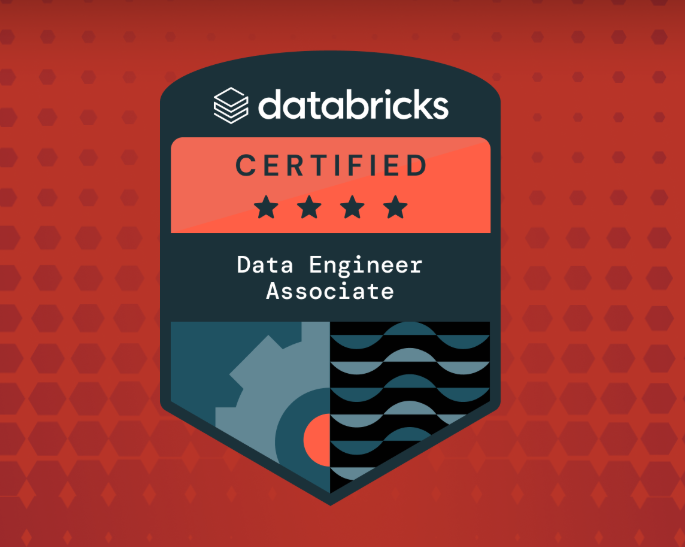
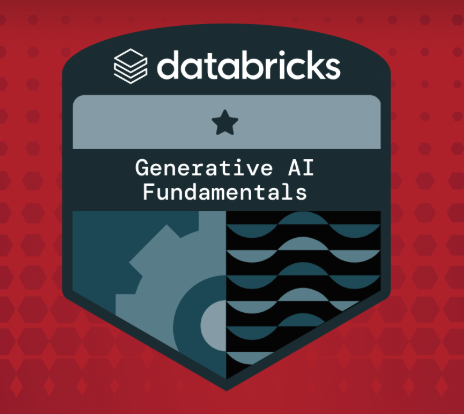

## Hi there, I'm Gift 👋
Data Engineer with experience building scalable data pipelines and data platforms using Spark, Scala, Java, PySpark, and cloud technologies.

  <!--  You can customize the typing text in the "lines=" section of the URL below -->
  <!--  For an ampersand (&), use &amp; (e.g., Analytics+%26+Optimization) -->
  

<!-- 🔗 Update these links with your own social media and contact information -->

  
  
   

## 🚀 About Me 
I’m a Data Engineer with 3+ years of experience in the banking industry, passionate about building reliable and scalable data systems. I enjoy designing idempotent data pipelines that transform raw data into meaningful insights that help answer real business questions.

My work focuses on building batch and streaming pipelines using technologies such as Apache Spark, PySpark, Apache Kafka, Scala, SQL, and Hadoop. I also spend time doing system analysis, ensuring that data platforms and pipelines are designed to be efficient, reliable, and able to handle large-scale data workloads. I have experience working in cloud environments including AWS and Databricks, where I build and optimize modern data solutions.

Outside of work, you’ll usually find me outdoors or playing pool, where I enjoy applying the same analytical thinking and strategy that I use when working with data.

<!-- 🌐 Replace "your-username" with your actual GitHub username -->
<!--### [🏆 Check Out My Full Portfolio Website](https://your-username.github.io/)-->

## 🛠️ Technical Skillset

      
## 🔭 Projects

- **FraudSentil:** Databricjs Real-Time Transaction Fraud Detection 
- **Databricks JobMarket Lakehouse:** Transforms raw job posting from an API into curated datasets that power dashboard and ML
- **Databricks Price Movers:** Real-time Crypto Price tracker in South African Time

## 🏅 Certifications

<table>
<tr>
<td>

</td>
<td>Databricks Data Engineer Associate</td>
</tr>

  <tr>
<td>

</td>
<td>Databricks Generative AI Fundamentals</td>
</tr>
</table

